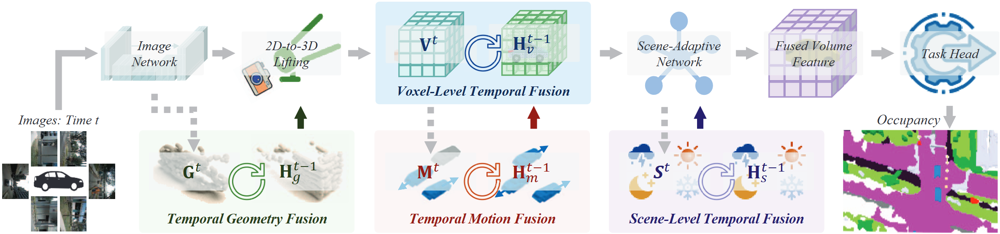

<div id="top" align="center">

# Rethinking Temporal Fusion with a Unified Gradient Descent View for 3D Semantic Occupancy Prediction

[](https://cdb342.github.io/GDFusion)
[](https://arxiv.org/abs/2504.12959)
[](https://opensource.org/licenses/Apache-2.0)

</div>

<p align="center">
  
  <br>
  <em><b>GDFusion</b> introduces a multi-level temporal fusion pipeline, seamlessly integrating voxel, scene, motion, and geometry temporal cues into a unified framework.</em>
</p>

## 💡 Why GDFusion?

In autonomous driving, understanding the 3D world over time is critical. Yet, most vision-based 3D Occupancy (VisionOcc) methods only scratch the surface of temporal fusion, focusing on simple voxel-level feature aggregation. This leaves a wealth of dynamic information on the table.

**GDFusion** changes the game by asking a fundamental question: *What if we could treat temporal fusion as an optimization problem?*

We reinterpret the classic RNN update as a **gradient descent step in the feature space**. This powerful new perspective allows us to design a unified framework that elegantly fuses diverse and heterogeneous temporal cues, unlocking new levels of performance and efficiency.

---

## 📦 Model Zoo

Our model checkpoints are available on [Hugging Face Hub](https://huggingface.co/Dobbin/OccStudio).

| Model | Annotation | Backbone | Input | Input Size | mIoU | mIoU_D | IoU | Checkpoint | Config |
|:---:|:---:|:---:|:---:|:---:|:---:|:---:|:---:|:---:|:---:|
| ALOcc-3D-GF | Occ3D | R-50 | C | `256x704` | **46.5** | 40.2 | 77.4 | [🤗 HF](https://huggingface.co/Dobbin/OccStudio/blob/main/alocc_3d_r50_256x704_bevdet_preatrain_gdfusion.pth) | [config](configs/gdfusion/alocc_3d_r50_256x704_bevdet_preatrain_gdfusion.py) |
| BEVDetOcc-GF | Occ3D | R-50 | C | `256x704` | **43.6** | 36.1 | 77.8 | [🤗 HF](https://huggingface.co/Dobbin/OccStudio/blob/main/bevdetocc_r50_256x704_bevdet_pretrain_gdfusion.pth) | [config](configs/gdfusion/bevdetocc_r50_256x704_bevdet_pretrain_gdfusion.py) |
| FB-Occ-GF | Occ3D | R-50 | C | `256x704` | **42.1** | 36.4 | 73.3 | [🤗 HF](https://huggingface.co/Dobbin/OccStudio/blob/main/fbocc-r50-cbgs_depth_16f_16x4_20e_gdfusion.pth) | [config](configs/gdfusion/fbocc-r50-cbgs_depth_16f_16x4_20e_gdfusion.py) |
| ALOcc-3D-GF | Occ3D | R-50 | C+D | `256x704` | **54.9** | 51.4 | 85.9 | [🤗 HF](https://huggingface.co/Dobbin/OccStudio/blob/main/alocc_3d_r50_256x704_bevdet_preatrain_gdfusion.pth) | [config](configs/gdfusion/alocc_3d_r50_256x704_bevdet_preatrain_gdfusion.py) |
| ALOcc-3D-GF | SurroundOcc | R-50 | C | `900x1600` | **25.5** | 22.5 | 38.2 | [🤗 HF](https://huggingface.co/Dobbin/OccStudio/blob/main/alocc_3d_r50_900x1600_bevdet_preatrain_gdfusion_surroundocc.pth) | [config](configs/gdfusion/alocc_3d_r50_900x1600_bevdet_preatrain_gdfusion_surroundocc.py) |

---

## 🚀 Get Started

### 1. Installation

```bash
# Clone this repository
git clone https://github.com/cdb342/GDFusion.git
cd GDFusion

# Create and activate the conda environment
conda create -n gdfusion python=3.8 -y
conda activate gdfusion

# Install PyTorch (adjust for your CUDA version if necessary)
pip install torch==2.0.1+cu118 torchvision==0.15.2+cu118 --index-url https://download.pytorch.org/whl/cu118

# Install crucial MMDetection dependencies
pip install openmim
mim install mmcv-full==1.7.0
pip install mmdet==2.28.2 mmsegmentation==0.30.0

# Install the GDFusion framework and other dependencies
pip install -v -e .
pip install torchmetrics timm dcnv4 ninja spconv transformers IPython einops numpy==1.23.4
```

### 2. Data Preparation

Organize your `data` directory as follows. The Occ3D annotations are required, while others are optional for extended research.

```
GDFusion/
└── data/
    └── nuscenes/
        ├── maps
        ├── samples
        ├── sweeps
        ├── v1.0-test
        ├── v1.0-trainval
        ├── gts                 # Required: Occ3D annotations
        └── ...                 # Optional annotations
```

<details>
<summary><b>Click to see details on downloading and placing all annotation sets</b></summary>

1.  **nuScenes Dataset**: Download from the [official website](https://www.nuscenes.org/download).
2.  **Occ3D Annotations**: Download from the [project page](https://tsinghua-mars-lab.github.io/Occ3D/) and place in `gts`.
3.  **(Optional) Other Annotations**:
    *   [OpenOcc_v2.1](https://github.com/OpenDriveLab/OccNet?tab=readme-ov-file#openocc-dataset) -> `openocc_v2`
    *   [OpenOcc_v2.1 Ray Mask](https://drive.google.com/file/d/10jB08Z6MLT3JxkmQfxgPVNq5Fu4lHs_h/view) -> `openocc_v2_ray_mask`
    *   [SurroundOcc](https://github.com/weiyithu/SurroundOcc) -> `gts_surroundocc`
    *   [OpenOccupancy-v0.1](https://github.com/JeffWang987/OpenOccupancy) -> `nuScenes-Occupancy-v0.1`

</details>

Finally, run the preprocessing scripts to prepare the data for training:

```bash
# 1. Extract semantic segmentation labels from LiDAR
python tools/nusc_process/extract_sem_point.py

# 2. Create formatted info files for the dataloader
PYTHONPATH=$(pwd):$PYTHONPATH python tools/create_data_bevdet.py
```
Alternatively, you can download the pre-processed [`segmentation labels`](https://huggingface.co/Dobbin/OccStudio/blob/main/lidar_seg.zip), [`train.pkl`](https://huggingface.co/Dobbin/OccStudio/blob/main/bevdetv2-nuscenes_infos_train.pkl) and [`val.pkl`](https://huggingface.co/Dobbin/OccStudio/blob/main/bevdetv2-nuscenes_infos_val.pkl) files from our Hugging Face Hub, and organize their path as:
```
ALOcc/
├── data/
│   ├── lidar_seg
│   ├── nuscenes/
│   │   ├── train.pkl
│   │   ├── val.pkl
│   │   ...
...
```

### 3. Pre-trained Backbones

For training, please download pre-trained image backbones from [BEVDet](https://github.com/HuangJunJie2017/BEVDet), [GeoMIM](https://github.com/Sense-X/GeoMIM), or our [Hugging Face Hub](https://huggingface.co/Dobbin/OccStudio). Place the checkpoint files in the `ckpts/pretrain/` directory.

---

## 🎮 Usage

### Training

Use our convenient script for distributed training on multiple GPUs.

```bash
# Syntax: bash tools/dist_train.sh [CONFIG_FILE] [WORK_DIR] [NUM_GPUS]

# Example: Train the ALOcc-3D-GDFusion model 
bash tools/dist_train.sh configs/gdfusion/alocc_3d_r50_256x704_bevdet_preatrain_gdfusion.py work_dirs/alocc3d_gdfusion 8
```

### Testing & Evaluation

Download a pre-trained model from our [Model Zoo](#-model-zoo) and evaluate its performance.

```bash
# Syntax: bash tools/dist_test.sh [CONFIG_FILE] [CHECKPOINT_PATH] [NUM_GPUS]

# Example: Evaluate the ALOcc-3D-GDFusion model
bash tools/dist_test.sh configs/gdfusion/alocc_3d_r50_256x704_bevdet_preatrain_gdfusion.py ckpts/alocc_3d_gdfusion.pth 8
```

> **⚠️ Important**: For temporal fusion inference, please use **1 or 8 GPUs** only. Using other GPU numbers might lead to incorrect results due to a sampler bug causing sample duplication.

### Benchmarking

We provide tools to easily benchmark model speed and computational cost.

```bash
# Benchmark FPS (Frames Per Second)
python tools/analysis_tools/benchmark.py configs/gdfusion/your_config.py

# Calculate FLOPs
python tools/analysis_tools/get_flops.py configs/gdfusion/your_config.py --shape 256 704
```


---

## 🙏 Acknowledgements

Our work is built upon the shoulders of giants. We gratefully acknowledge the excellent research and open-source code from:
[open-mmlab](https://github.com/open-mmlab), [BEVDet](https://github.com/HuangJunjie2017/BEVDet), [FB-Occ](https://github.com/NVlabs/FB-BEV), [FlashOcc](https://github.com/Yzichen/FlashOCC), and [Occ3D](https://github.com/Tsinghua-MARS-Lab/Occ3D).

---

## 📜 Citation

If you find GDFusion useful in your work, please cite our paper:

```bibtex
@InProceedings{chen2025rethinking,
    author    = {Chen, Dubing and Zheng, Huan and Fang, Jin and Dong, Xingping and Li, Xianfei and Liao, Wenlong and He, Tao and Peng, Pai and Shen, Jianbing},
    title     = {Rethinking Temporal Fusion with a Unified Gradient Descent View for 3D Semantic Occupancy Prediction},
    booktitle = {Proceedings of the IEEE/CVF Conference on Computer Vision and Pattern Recognition (CVPR)},
    month     = {June},
    year      = {2025}
}
```

<p align="right"><a href="#top">🔼 Back to Top</a></p>
